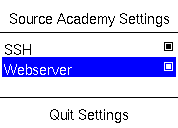

# ev3dev-service-control

A GUI application to control running services on the EV3. Tailored to the [EV3-source](https://github.com/source-academy/ev3-source) image used in Source Academy@NUS.



## Building

```bash
docker build -t compiler .
docker run --rm -v "$(pwd)":/src -w /src -u 0:0 compiler -o bin main.vala
```

## How it works

It works in conjuction with the [EV3-Source](https://github.com/source-academy/ev3-source) OS to enable/disable certain services in order to get additional security benefits:

* For SSH, it simply toggles the service state via systemd.
* For the web server, it toggles the contents of the `/srv/www/cgi-bin/.enable` file between "0" and "1". It is expected that any scripts that render the webpage respect this file and conditionally render their outputs accordingly

**Note:** Sometimes, the EV3 will run out of RAM when trying to toggle the SSH service. This will result in the app falsely marking the state as successfully toggled. Quitting the app and opening it again will reveal the true state of the SSH service. Unfortunately, to solve the RAM issue, there does not seem to be an easy way other than restarting/reflashing the entire OS once this happens.

### Assumptions/Preconditions

* SSH service is present on the EV3
* A one-byte file `/srv/www/cgi-bin/.enable` is present with contents either "1" or "0"
